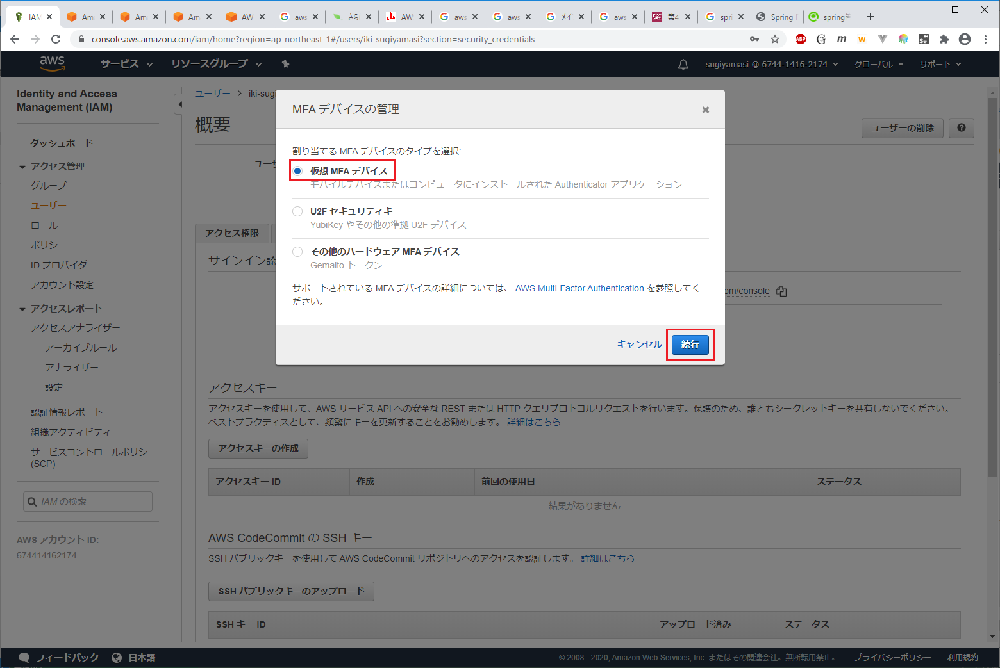

# AWS 検証環境情報

## 準備

1. google authentiatorのインストール
iOS, Android端末に`google authentiator`をインストールしておく。

## AWSアカウントへのMFA追加

1. IAMで自分のユーザを選択し、「認証情報」タブ中の「MFA デバイスの割り当て」の「管理」を押下する


1. 「仮想 MFA デバイス」選択し「続行」を押下する


1. 表示されたQAコードを`google authentiator`に読み込ませ、表示されたPINコードを2回分入力して「MFAの割り当て」を押下する


## bastionへの接続

1. 以下のQRコードを`google authentiator`に読み込ませておく


1. `git bash`などからssh 接続（`putty`などから接続する場合、鍵の場所を指定してください）
```bash
ssh -i ~/.ssh/bastion-user.pem bastion-user@54.250.84.194
```
	- `.bashrc`に`alias ssh='ssh -o ServerAliveInterval=60'`を書いておくとSSHのセッションが切れることを防止できます。

1. `google authentiator`に表示されたPINを入力する
```bash
Verification code:
```

1. 踏み台からworkサーバへの接続  
```bash
ssh -i ~/.ssh/developer.pem developer@172.17.1.231
```
	- 踏み台での作業は、ホームディレクトリの下に「kondoukta」や「sugiyamasi」などの自分用のディレクトリを作成して作業してください。
	- IPアドレスは変わることがあるため、ログインできない場合は、AWSのマネコンのEC2画面で`webbilling-work`サーバのローカルIPアドレスを確認して下さい。

## CodeComit

### リポジトリ

| リポジトリ | 用途 | URL | 
|:-----|:-----|:-----|
| webbilling | コード管理 | https://git-codecommit.ap-northeast-1.amazonaws.com/v1/repos/webbilling |
| webbilling-doc | ドキュメント管理 | https://git-codecommit.ap-northeast-1.amazonaws.com/v1/repos/webbilling-doc |
| webbilling-exeo | コード管理 | https://git-codecommit.ap-northeast-1.amazonaws.com/v1/repos/webbilling-exeo |
| webbilling-exeo-doc | ドキュメント管理 | https://git-codecommit.ap-northeast-1.amazonaws.com/v1/repos/webbilling-exeo-doc |
| webbilling-iki | コード管理 | https://git-codecommit.ap-northeast-1.amazonaws.com/v1/repos/webbilling-iki |
| webbilling-iki-doc | ドキュメント管理 | https://git-codecommit.ap-northeast-1.amazonaws.com/v1/repos/webbilling-iki-doc |

### gitリポジトリのクローン  

```bash
git clone <上記のURL>
```
プロンプトでID/PWが求められるので、`****_codecommit_credentials.csv`中の`User Name`と`Password`を入力して下さい。

## Oracleへの接続

### 設定情報

| 項目 | 説明 | 
|:-----|:-----|
| エンドポイント | webbillng-db.cyqckoqjqzte.ap-northeast-1.rds.amazonaws.com |
| ポート | 1521 |
| SID | ORCL |
| ユーザID | admin |
| パスワード | webbillng-oracle |

### DBへの接続

```bash
sqlplus admin@webbillng-db.cyqckoqjqzte.ap-northeast-1.rds.amazonaws.com:1521/ORCL
```
